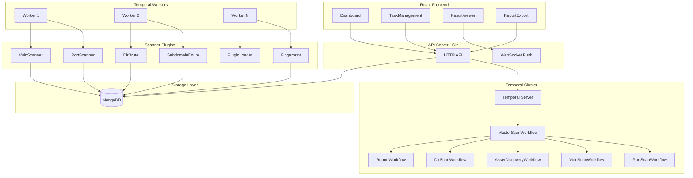
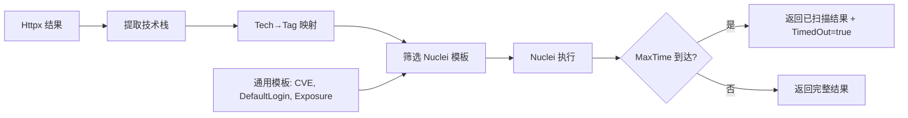
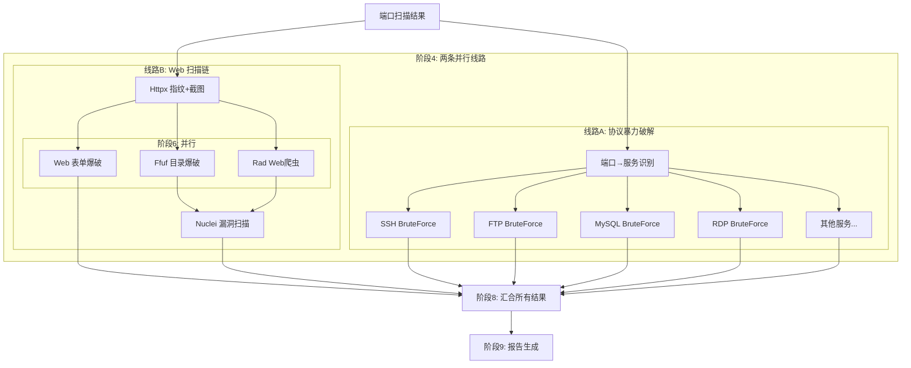
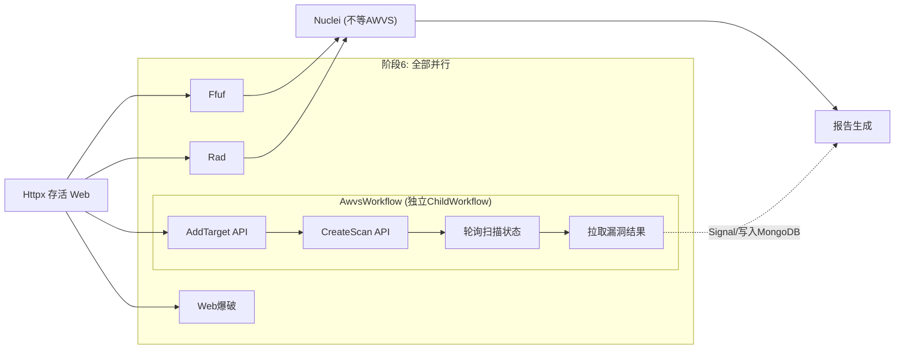

# 分布式安全扫描器 (Distributed Scanner)

## 整体架构




## 项目目录结构

```
distributed-scanner/
├── cmd/
│   ├── api/main.go              # API 服务入口
│   ├── worker/main.go           # Temporal Worker 入口
│   └── cli/main.go              # CLI 工具入口
├── internal/
│   ├── api/                     # HTTP API 层
│   │   ├── handler/             # 请求处理器
│   │   ├── middleware/          # 中间件(认证、日志、限流)
│   │   └── router.go           # 路由注册
│   ├── workflow/                # Temporal Workflows
│   │   ├── master.go           # 主编排工作流
│   │   ├── portscan.go         # 端口扫描工作流
│   │   ├── vulnscan.go         # 漏洞扫描工作流
│   │   ├── assetscan.go        # 资产发现工作流
│   │   ├── dirscan.go          # 目录扫描工作流
│   │   ├── bruteforce.go       # 暴力破解工作流 (协议+Web表单)
│   │   ├── awvs.go             # AWVS 扫描工作流 (异步，不阻塞主流程)
│   │   └── report.go           # 报告生成工作流
│   ├── activity/                # Temporal Activities
│   │   ├── naabu.go            # naabu 端口扫描活动
│   │   ├── nuclei.go           # nuclei 漏洞扫描活动 (含 max_time 优雅超时)
│   │   ├── subfinder.go        # subfinder 子域名枚举活动
│   │   ├── ffuf.go             # ffuf 目录爆破活动
│   │   ├── httpx.go            # httpx 指纹识别+截图活动
│   │   ├── bruteforce.go       # 协议暴力破解活动 (SSH/FTP/RDP/MySQL等)
│   │   ├── web_bruteforce.go   # Web 登录表单暴力破解活动
│   │   ├── rad.go              # Rad 爬虫活动
│   │   ├── awvs.go             # AWVS API 调用活动 (添加目标/创建扫描/轮询/拉取结果)
│   │   └── report.go           # 报告生成活动
│   ├── scanner/                 # 扫描器核心实现
│   │   ├── naabu/              # naabu 封装 (端口扫描，SYN/Connect/UDP)
│   │   ├── nuclei/             # nuclei 封装 (漏洞扫描，指纹驱动模板选择，max_time)
│   │   ├── subfinder/           # subfinder 封装 (子域名枚举，支持多数据源 API Key)
│   │   ├── ffuf/               # ffuf 封装 (目录爆破，支持自定义字典)
│   │   ├── httpx/              # httpx 封装 (指纹识别、截图、去重)
│   │   ├── bruteforce/         # 协议暴力破解 (SSH/FTP/RDP/MySQL/MSSQL/Oracle等)
│   │   ├── rad/                # Rad 爬虫封装 (CLI 调用，解析结果)
│   │   ├── awvs/               # AWVS REST API 客户端封装
│   │   └── common/             # 公共扫描工具(HTTP客户端、DNS客户端等)
│   ├── plugin/                  # 插件系统
│   │   ├── manager.go          # 插件管理器
│   │   ├── loader.go           # Go plugin 加载器
│   │   └── interface.go        # 插件接口定义
│   ├── model/                   # 数据模型
│   │   ├── task.go             # 扫描任务模型
│   │   ├── target.go           # 扫描目标模型
│   │   ├── result.go           # 扫描结果模型
│   │   ├── brute_result.go    # 暴力破解结果模型
│   │   ├── provider.go         # 数据源 API Key 配置模型
│   │   ├── dictionary.go       # 字典模型
│   │   └── report.go           # 报告模型
│   ├── store/                   # MongoDB 数据访问层
│   │   ├── mongo.go            # MongoDB 连接管理
│   │   ├── task_store.go       # 任务 CRUD
│   │   ├── result_store.go     # 结果 CRUD
│   │   ├── provider_store.go   # 数据源配置 CRUD
│   │   └── dictionary_store.go # 字典 CRUD (GridFS)
│   └── report/                  # 报告生成
│       ├── html.go             # HTML 报告
│       ├── pdf.go              # PDF 报告
│       └── json.go             # JSON 报告
├── pkg/
│   ├── config/config.go         # 配置管理 (Viper)
│   └── logger/logger.go        # 日志 (Zap)
├── web/                         # React + TypeScript 前端
│   ├── src/
│   │   ├── pages/              # 页面组件
│   │   ├── components/         # 通用组件
│   │   ├── api/                # API 调用
│   │   └── store/              # 状态管理
│   └── package.json
├── plugins/                     # 外部插件目录
│   └── example/                # 示例插件
├── configs/
│   └── config.yaml             # 默认配置文件
├── deployments/
│   └── docker-compose.yml      # 一键部署 (Temporal + MongoDB + API + Worker)
├── dictionaries/               # 字典文件
│   ├── dirs.txt                # 目录爆破字典
│   └── subdomains.txt          # 子域名字典
├── Makefile
├── go.mod
└── README.md
```

## 核心设计

### 1. Temporal Workflow 编排

**MasterScanWorkflow** 是核心编排入口，根据用户配置的扫描策略，按依赖关系编排子工作流：

```
MasterScan 接收 ScanTask (目标可以是: 域名列表、IP列表、CIDR 或混合)
  │
  ├─ [阶段1 - 并行] 资产发现
  │   ├─ 子域名枚举 (SubfinderWorkflow) → 得到所有子域名
  │   └─ DNS解析 Activity → 域名→IP 映射关系
  │
  ├─ [阶段2] 构建扫描目标矩阵
  │   └─ 合并用户输入IP + 子域名解析IP，构建 Host→IP 映射表
  │      例: {a.example.com→10.0.0.1, b.example.com→10.0.0.1, c.example.com→10.0.0.2}
  │
  ├─ [阶段3] 端口扫描 (PortScanWorkflow, naabu) ─ 按去重后的唯一IP扫描
  │   ├─ NaabuScan Activity (IP=10.0.0.1, Ports=1-500)   → Worker A
  │   ├─ NaabuScan Activity (IP=10.0.0.1, Ports=501-1000) → Worker B
  │   ├─ NaabuScan Activity (IP=10.0.0.2, Ports=1-500)   → Worker C
  │   └─ ...
  │
  ├─ [阶段4 - 并行] 端口扫描后的两条并行线
  │   │
  │   ├─ [线路A] 协议暴力破解 (BruteForceWorkflow)
  │   │   └─ 根据端口→服务映射，对非HTTP服务进行凭据爆破
  │   │      ├─ BruteForce Activity (IP=10.0.0.1:22, service=ssh)    → Worker A
  │   │      ├─ BruteForce Activity (IP=10.0.0.1:3306, service=mysql) → Worker B
  │   │      ├─ BruteForce Activity (IP=10.0.0.2:21, service=ftp)    → Worker C
  │   │      └─ ... 每个 IP:Port:Service 一个 Activity
  │   │
  │   └─ [线路B] Web 扫描链 (与协议爆破并行)
  │       │
  │       ├─ [阶段4b] 构建 Httpx 目标 (Host维度展开)
  │       │   └─ 将 "唯一IP的开放端口" × "Host→IP映射" 展开
  │       │
  │       ├─ [阶段5] Httpx 指纹识别+截图 (按 Host:Port 维度)
  │       │   └─ 输出: 存活 Web 列表 + 技术栈 + 检测到的登录页面
  │       │
  │       ├─ [阶段6 - 并行] (httpx 完成后同时启动以下所有任务)
  │       │   ├─ 目录爆破 (ffuf) ─ 存活 Web 列表
  │       │   ├─ Web 表单暴力破解 ─ 检测到的登录页面
  │       │   ├─ Web 爬虫 (Rad) ─ 存活 Web 列表
  │       │   └─ [fire-and-forget] AWVS 扫描 (AwvsWorkflow 作为独立 ChildWorkflow)
  │       │      ├─ 提交存活 Web 到 AWVS → 通过 AWVS REST API 创建扫描任务
  │       │      ├─ 异步轮询 AWVS 扫描状态 → 不阻塞 ffuf/Rad/nuclei 等后续阶段
  │       │      └─ 扫描完成后拉取结果写入 MongoDB，通过 Temporal Signal 通知主流程
  │       │
  │       ├─ [阶段7] 漏洞扫描 (nuclei) ─ 依赖 ffuf + Rad 结果 (不等 AWVS)
  │       │   └─ 扫描范围: httpx 存活 Web + ffuf 隐藏路径 + Rad 爬取的URL/参数
  │       │
  │       └─ (汇合 ffuf/Rad/nuclei/Web爆破)
  │
  ├─ [阶段8 - 汇合] 合并协议爆破 + Web扫描链的全部结果
  │
  ├─ [阶段9 - 可选等待] 如果 AWVS 已完成则合并结果；如未完成可先出报告
  │   └─ 用户可配置: 报告是否等待 AWVS 完成 (wait_awvs: true/false)
  │
  └─ [阶段10] 报告生成 (ReportWorkflow)
```

> **关键洞察**: naabu 只需要按唯一 IP 扫描端口（避免同 IP 重复扫描），但 httpx 必须按 Host:Port 维度请求（因为虚拟主机下同 IP 同端口不同 Host 返回不同网站）。两个阶段的去重粒度不同。

#### PortScanWorkflow 端口分片并行设计

```mermaid
graph TB
    subgraph master [MasterScanWorkflow]
        Input["ScanTask (域名/IP/CIDR)"]
        Subfinder["SubfinderActivity"]
        DNS["DNSResolveActivity"]
        BuildMatrix["构建 Host-IP 映射表"]

        subgraph portScan [PortScanWorkflow - 按唯一IP扫描]
            Split[SplitChunks]
            N1["Naabu: IP1, Ports 1-500"]
            N2["Naabu: IP1, Ports 501-1000"]
            N3["Naabu: IP2, Ports 1-500"]
            NN["Naabu: ..."]
            MergeIP["MergeByIP 汇总开放端口"]
        end

        ExpandHost["展开 Host 维度: IP:Port × Host映射"]

        subgraph httpxScan [HttpxWorkflow - 按Host:Port扫描]
            H1["Httpx: a.example.com:80"]
            H2["Httpx: b.example.com:80"]
            H3["Httpx: c.example.com:443"]
            DedupResp["ResponseHash 去重"]
        end

        subgraph ffufScan [FfufScanWorkflow - 目录爆破]
            F1["Ffuf: a.example.com"]
            F2["Ffuf: b.example.com"]
            FN["Ffuf: ..."]
        end

        VulnScan["VulnScanWorkflow"]
        Report["ReportWorkflow"]
    end

    Input --> Subfinder
    Input --> DNS
    Subfinder --> BuildMatrix
    DNS --> BuildMatrix
    BuildMatrix --> Split

    Split --> N1
    Split --> N2
    Split --> N3
    Split --> NN
    N1 --> MergeIP
    N2 --> MergeIP
    N3 --> MergeIP
    NN --> MergeIP

    MergeIP --> ExpandHost
    ExpandHost --> H1
    ExpandHost --> H2
    ExpandHost --> H3
    H1 --> DedupResp
    H2 --> DedupResp
    H3 --> DedupResp

    DedupResp --> F1
    DedupResp --> F2
    DedupResp --> FN
    F1 --> VulnScan
    F2 --> VulnScan
    FN --> VulnScan
    VulnScan --> Report
```




核心逻辑伪代码：

```go
// MasterScanWorkflow 是总编排入口
func MasterScanWorkflow(ctx workflow.Context, task ScanTask) (*ScanReport, error) {

    // ========== 阶段1: 资产发现 (并行) ==========
    subfinderFuture := workflow.ExecuteChildWorkflow(ctx, SubfinderWorkflow, task.Domains)
    dnsFuture := workflow.ExecuteActivity(ctx, DNSResolveActivity, task.Domains)

    var subdomains []string
    subfinderFuture.Get(ctx, &subdomains)     // 所有发现的子域名
    allDomains := append(task.Domains, subdomains...)

    var dnsMap map[string][]string            // domain → []IP
    dnsFuture.Get(ctx, &dnsMap)

    // ========== 阶段2: 构建 Host→IP 映射矩阵 ==========
    // 合并: 用户输入IP + 所有域名解析出的IP
    // hostIPMap: {"a.example.com": ["10.0.0.1"], "b.example.com": ["10.0.0.1"], ...}
    hostIPMap := buildHostIPMap(allDomains, dnsMap, task.IPs)
    uniqueIPs := extractUniqueIPs(hostIPMap)  // 去重IP，naabu 只需扫唯一IP

    // ========== 阶段3: 端口扫描 (仅按唯一IP) ==========
    portRanges := resolvePortStrategy(task.NaabuOptions.PortStrategy, task.NaabuOptions.CustomPorts)
    chunks := splitPortRange(portRanges, task.NaabuOptions.ChunkSize)

    var portFutures []workflow.Future
    for _, ip := range uniqueIPs {
        for _, chunk := range chunks {
            f := workflow.ExecuteActivity(ctx, NaabuScanActivity, NaabuScanInput{
                Host: ip, Ports: chunk, Options: task.NaabuOptions,
            })
            portFutures = append(portFutures, f)
        }
    }

    // 汇总: 按 IP:Port:Protocol 去重 (IP 维度去重，避免分片重叠)
    ipPortMap := make(map[string][]PortResult) // IP → 开放端口列表
    for _, f := range portFutures {
        var r NaabuScanOutput
        if err := f.Get(ctx, &r); err != nil { continue }
        for _, p := range r.OpenPorts {
            key := p.IP
            ipPortMap[key] = dedupAppend(ipPortMap[key], p)
        }
    }

    // ========== 阶段4: 两条并行线路 (协议爆破 || Web扫描链) ==========

    // --- [线路A] 协议暴力破解 (与线路B完全并行) ---
    // 根据端口号自动识别服务类型，对非HTTP服务进行凭据爆破
    bruteForceFuture := workflow.ExecuteChildWorkflow(ctx, BruteForceWorkflow, BruteForceInput{
        Targets:  buildBruteTargets(ipPortMap),  // 从端口结果中筛选可爆破服务
        Options:  task.BruteForceOptions,
    })

    // --- [线路B] Web 扫描链 ---

    // 阶段4b: Host维度展开 → Httpx 目标
    var httpxTargets []HttpxTarget
    for host, ips := range hostIPMap {
        for _, ip := range ips {
            if ports, ok := ipPortMap[ip]; ok {
                for _, p := range ports {
                    httpxTargets = append(httpxTargets, HttpxTarget{
                        Host: host, IP: ip, Port: p.Port, Protocol: p.Protocol,
                    })
                }
            }
        }
    }

    // 阶段5: Httpx 指纹识别 + 截图
    var httpxResult HttpxOutput
    workflow.ExecuteActivity(ctx, HttpxActivity, HttpxInput{
        Targets: httpxTargets,
        Options: task.HttpxOptions,
    }).Get(ctx, &httpxResult)

    // 阶段6: 目录爆破 + Web表单暴力破解 + Rad爬虫 + AWVS (全部并行)
    aliveWebs := filterAliveWebs(httpxResult.Results)
    loginPages := filterLoginPages(httpxResult.Results)

    // 6d: AWVS 扫描 (fire-and-forget ChildWorkflow，不阻塞后续)
    var awvsFuture workflow.ChildWorkflowFuture
    if task.AwvsOptions.Enabled {
        awvsCtx := workflow.WithChildOptions(ctx, workflow.ChildWorkflowOptions{
            ParentClosePolicy: enums.PARENT_CLOSE_POLICY_ABANDON, // 主流程完成不影响 AWVS
        })
        awvsFuture = workflow.ExecuteChildWorkflow(awvsCtx, AwvsWorkflow, AwvsInput{
            Targets: aliveWebs,
            Options: task.AwvsOptions,
        })
        // 不调用 .Get()，不阻塞！AWVS 在后台独立运行
    }

    // 6a: 目录爆破 (ffuf)
    var ffufFutures []workflow.Future
    for _, web := range aliveWebs {
        f := workflow.ExecuteActivity(ctx, FfufScanActivity, FfufScanInput{
            TargetURL: web.URL, Host: web.Host,
            DictionaryID: task.FfufOptions.DictionaryID,
            Options: task.FfufOptions,
        })
        ffufFutures = append(ffufFutures, f)
    }

    // 6b: Web 登录表单暴力破解 (与 ffuf、Rad 并行)
    var webBruteFutures []workflow.Future
    for _, login := range loginPages {
        f := workflow.ExecuteActivity(ctx, WebBruteForceActivity, WebBruteForceInput{
            LoginURL:  login.URL,
            FormInfo:  login.FormInfo,
            Options:   task.BruteForceOptions.WebOptions,
        })
        webBruteFutures = append(webBruteFutures, f)
    }

    // 6c: Rad 爬虫 (与 ffuf、Web爆破 并行)
    var radFutures []workflow.Future
    for _, web := range aliveWebs {
        f := workflow.ExecuteActivity(ctx, RadCrawlActivity, RadCrawlInput{
            TargetURL: web.URL,
            Host:      web.Host,
            Options:   task.RadOptions,
        })
        radFutures = append(radFutures, f)
    }

    // 等待 ffuf、Web 表单爆破、Rad 爬虫全部完成
    var allDirResults []DirResult
    for _, f := range ffufFutures {
        var r FfufScanOutput
        if err := f.Get(ctx, &r); err != nil { continue }
        allDirResults = append(allDirResults, r.Paths...)
    }
    var webBruteResults []BruteResult
    for _, f := range webBruteFutures {
        var r WebBruteForceOutput
        if err := f.Get(ctx, &r); err != nil { continue }
        webBruteResults = append(webBruteResults, r.Results...)
    }
    var allCrawlResults []CrawlResult
    for _, f := range radFutures {
        var r RadCrawlOutput
        if err := f.Get(ctx, &r); err != nil { continue }
        allCrawlResults = append(allCrawlResults, r.Results...)
    }

    // 阶段7: 漏洞扫描 (nuclei) ─ 汇总 httpx + ffuf + Rad 的全部结果
    nucleiTargets := buildNucleiTargets(httpxResult.Results, allDirResults, allCrawlResults)
    var nucleiFutures []workflow.Future
    for _, target := range nucleiTargets {
        f := workflow.ExecuteActivity(ctx, NucleiScanActivity, NucleiScanInput{
            Target: target.URL, Host: target.Host,
            Technologies: target.Technologies,
            ExtraPaths:   target.DiscoveredPaths,
            Options:      task.NucleiOptions,
        })
        nucleiFutures = append(nucleiFutures, f)
    }
    var allVulns []VulnResult
    for _, f := range nucleiFutures {
        var r NucleiScanOutput
        if err := f.Get(ctx, &r); err != nil { continue }
        allVulns = append(allVulns, r.Vulnerabilities...)
    }

    // ========== 阶段8: 汇合 - 等待协议爆破完成 ==========
    var protocolBruteResults BruteForceOutput
    bruteForceFuture.Get(ctx, &protocolBruteResults)

    // ========== 阶段9: 可选等待 AWVS 结果 ==========
    var awvsResults []VulnResult
    if task.AwvsOptions.Enabled && awvsFuture != nil {
        if task.AwvsOptions.WaitForResult {
            // 用户选择等待 AWVS 完成再出报告
            var awvsOutput AwvsOutput
            awvsFuture.Get(ctx, &awvsOutput) // 此时才阻塞等待
            awvsResults = awvsOutput.Vulnerabilities
        } else {
            // 不等待，尝试获取已有结果 (AWVS 可能还在运行)
            // AWVS ChildWorkflow 完成后会通过 Signal 通知并写入 MongoDB
            // 报告中标注 "AWVS 扫描进行中，结果稍后补充"
        }
    }

    // ========== 阶段10: 报告生成 ==========
    // 合并所有结果: 端口 + 指纹 + 目录 + 爬虫 + 协议爆破 + Web爆破 + nuclei漏洞 + AWVS漏洞
    // ...
}
```

**两层去重设计：**


| 阶段           | 去重维度                  | 原因                                          |
| ------------ | --------------------- | ------------------------------------------- |
| naabu 端口扫描汇总 | IP:Port:Protocol      | naabu 只需按唯一 IP 扫描，避免同 IP 重复扫描浪费资源           |
| Host 维度展开    | Host:IP:Port:Protocol | 同 IP:Port 下不同 Host (虚拟主机) 是不同网站，必须独立探测      |
| httpx 响应去重   | ResponseBodyHash      | 即使 Host 不同，如果响应内容完全一致 (如默认页)，可按 hash 去重减少噪音 |


**HttpxTarget 数据结构：**

```go
type HttpxTarget struct {
    Host     string `json:"host"`     // 域名 (a.example.com) 或 IP 本身
    IP       string `json:"ip"`       // 实际连接的 IP
    Port     int    `json:"port"`     // 端口
    Protocol string `json:"protocol"` // "tcp" | "udp"
}
```

httpx 调用时: 连接到 `IP:Port`，但 HTTP 请求中设置 `Host: {Host}` Header，这样同一个 IP:Port 下不同域名会返回对应的虚拟主机页面。

关键设计点：

- **端口策略**: 支持 full / top100 / top1000 / custom 四种模式
- **UDP 支持**: 通过 `NaabuOptions.ScanType` 控制
- **IP 维度端口扫描**: naabu 只扫描去重后的唯一 IP 集合，避免同 IP 被多个域名触发重复扫描
- **Host 维度展开**: 端口扫描结果 × Host→IP 映射 = 完整的 Host:IP:Port 目标矩阵
- **三层去重**: IP:Port (naabu) → Host:IP:Port (展开) → ResponseHash (httpx)
- **分片粒度可配置**: `chunkSize` 默认 500 端口/chunk
- **naabu 作为 Go library**: Activity 内部直接调用 naabu runner
- **自动重试 + Heartbeat**: 每个 Activity 独立容错

关键 Temporal 特性使用：

- **Child Workflow** 实现多阶段子任务编排 (Subfinder → Naabu → Httpx → Vuln/Dir → Report)
- **Activity Fan-out** 端口扫描按 IP×端口chunk 拆分、httpx 按 Host:Port 拆分，Temporal 自动分发给空闲 Worker
- **Activity Retry Policy** 处理网络超时重试，单个分片失败不影响整体
- **Heartbeat** 监控长时间运行的扫描活动，Worker 宕机自动重调度
- **Signal** 支持暂停/恢复/取消扫描
- **Query** 实时查询扫描进度（当前阶段 + 已完成分片数 / 总分片数）
- **Workflow ID** 去重，防止重复扫描
- **Saga Pattern** 某阶段失败时清理已产生的中间数据

### 2. 扫描器模块

- **PortScan (naabu)**: SYN/Connect 扫描、UDP 扫描、Top100/Top1000/全端口/自定义端口区间 → 以 Go library 方式调用 projectdiscovery/naabu，支持自定义参数透传
- **Httpx (指纹识别)**: 指纹识别、网页截图、响应去重 (仅对开放端口) → 以 Go library 方式调用 projectdiscovery/httpx，支持自定义参数透传
- **Subdomain (subfinder)**: 被动子域名枚举，聚合 40+ 数据源 → 以 Go library 方式调用 projectdiscovery/subfinder，前端可配置各数据源 API Key
- **VulnScan (nuclei)**: 基于指纹信息智能匹配模板进行漏洞检测，支持 max_time 优雅超时 → 以 Go library 方式调用 projectdiscovery/nuclei，根据 httpx 识别的技术栈自动筛选相关模板
- **DirScan (ffuf)**: 目录/文件爆破 → 以 Go library 方式调用 ffuf/ffuf，依赖 httpx 存活 Web 列表，支持前端自定义字典上传/管理
- **BruteForce (协议)**: 根据端口服务自动匹配，支持 SSH/FTP/RDP/MySQL/MSSQL/Oracle/Redis/SMB 等 → Go 原生协议库，与 httpx 并行执行
- **BruteForce (Web表单)**: 自动检测登录页面并爆破 → 依赖 httpx 识别的登录表单，与 ffuf 并行执行
- **Crawler (Rad)**: Web 爬虫，爬取 URL、带参数链接、表单、API 接口 → 调用 Rad CLI，与 ffuf 并行执行，结果作为 nuclei 额外输入

### 3. Naabu 端口扫描模块设计

基于 [projectdiscovery/naabu](https://github.com/projectdiscovery/naabu) 作为 Go library 调用，在 Temporal Activity 中封装。

**端口策略 (PortStrategy)：**

- `full` — 全端口扫描 1-65535
- `top100` — naabu 内置 Top 100 常见端口
- `top1000` — naabu 内置 Top 1000 常见端口
- `custom` — 自定义端口，支持混合格式: `"22,80,443,8000-9000,27017"`

**自定义参数 (NaabuOptions)：**

```go
type NaabuOptions struct {
    PortStrategy   string `json:"port_strategy" bson:"port_strategy"`     // "full" | "top100" | "top1000" | "custom"
    CustomPorts    string `json:"custom_ports" bson:"custom_ports"`       // 自定义端口: "80,443,8000-9000"
    ScanType       string `json:"scan_type" bson:"scan_type"`             // "syn" | "connect" | "udp"
    EnableUDP      bool   `json:"enable_udp" bson:"enable_udp"`           // 是否同时扫描 UDP 端口
    Rate           int    `json:"rate" bson:"rate"`                       // 发包速率 (packets/sec)，默认 1000
    Threads        int    `json:"threads" bson:"threads"`                 // 并发线程数，默认 25
    Timeout        int    `json:"timeout" bson:"timeout"`                 // 超时(ms)，默认 1000
    Retries        int    `json:"retries" bson:"retries"`                 // 重试次数，默认 3
    WarmUpTime     int    `json:"warm_up_time" bson:"warm_up_time"`       // 预热时间(秒)
    InterfaceName  string `json:"interface" bson:"interface"`             // 网络接口名
    Nmap           bool   `json:"nmap" bson:"nmap"`                       // 是否对开放端口调用 nmap 做服务探测
    ServiceVersion bool   `json:"service_version" bson:"service_version"` // 启用服务版本检测
    ExcludePorts   string `json:"exclude_ports" bson:"exclude_ports"`     // 排除端口
    ChunkSize      int    `json:"chunk_size" bson:"chunk_size"`           // 分片大小，默认 500
}
```

**Activity 内部调用流程：**

```go
func NaabuScanActivity(ctx context.Context, input NaabuScanInput) (*NaabuScanOutput, error) {
    // 1. 构造 naabu runner.Options，映射 NaabuOptions 所有字段
    // 2. 设置目标 Host + 端口 chunk
    // 3. 如果 EnableUDP=true，先做 TCP 扫描再做 UDP 扫描，合并结果
    // 4. 启动 naabu runner，通过回调收集开放端口
    // 5. 定时上报 Temporal Heartbeat (已扫描端口数/总数)
    // 6. 返回开放端口列表 (IP, Port, Protocol)
}
```

**UDP 扫描设计：**

- `ScanType="udp"` → 仅 UDP 扫描
- `EnableUDP=true` + `ScanType="syn"` → TCP SYN + UDP 双协议扫描，在同一个 Activity 内串行执行，结果合并
- UDP 扫描结果的 Protocol 字段标记为 "udp"，与 TCP 结果区分

### 4. Subfinder 子域名枚举模块设计

基于 [projectdiscovery/subfinder](https://github.com/projectdiscovery/subfinder) 作为 Go library 调用，在 Temporal Activity 中封装。

**核心能力：**

- **被动枚举**: 聚合 40+ 数据源 (Shodan, Censys, SecurityTrails, VirusTotal, Chaos, FOFA, Hunter 等)
- **API Key 管理**: 通过前端配置各数据源的 API Key，存储在 MongoDB 中，扫描时动态加载
- **自定义参数**: 控制超时、线程、数据源选择等

**API Key 管理设计：**

API Key 以 provider 为粒度存储在 MongoDB `provider_configs` 集合中：

```go
type ProviderConfig struct {
    ID        primitive.ObjectID `json:"id" bson:"_id,omitempty"`
    Provider  string             `json:"provider" bson:"provider"`   // "shodan", "censys", "virustotal" 等
    APIKey    string             `json:"api_key" bson:"api_key"`     // 加密存储
    APISecret string             `json:"api_secret" bson:"api_secret"` // 部分 provider 需要 (如 censys)
    Enabled   bool               `json:"enabled" bson:"enabled"`
    CreatedAt time.Time          `json:"created_at" bson:"created_at"`
    UpdatedAt time.Time          `json:"updated_at" bson:"updated_at"`
}
```

**支持的数据源 (前端展示为列表，用户可逐一配置)：**

- Shodan, Censys, SecurityTrails, VirusTotal, Chaos
- FOFA, Hunter, Quake, ZoomEye
- BinaryEdge, PassiveTotal, Recon.dev
- GitHub, GitLab (代码搜索子域名)
- 以及 subfinder 支持的所有其他 provider

**自定义参数 (SubfinderOptions)：**

```go
type SubfinderOptions struct {
    Threads        int      `json:"threads" bson:"threads"`               // 并发线程数，默认 10
    Timeout        int      `json:"timeout" bson:"timeout"`               // 超时(秒)，默认 30
    MaxEnumTime    int      `json:"max_enum_time" bson:"max_enum_time"`   // 最大枚举时间(分钟)
    Sources        []string `json:"sources" bson:"sources"`               // 指定使用的数据源，为空则使用全部
    ExcludeSources []string `json:"exclude_sources" bson:"exclude_sources"` // 排除的数据源
    OnlyRecursive  bool     `json:"only_recursive" bson:"only_recursive"` // 仅递归枚举
    All            bool     `json:"all" bson:"all"`                       // 使用所有数据源（含需要 API Key 的）
}
```

**Activity 内部调用流程：**

```go
func SubfinderActivity(ctx context.Context, input SubfinderInput) (*SubfinderOutput, error) {
    // 1. 从 MongoDB 加载已配置且 Enabled 的 ProviderConfig 列表
    // 2. 构造 subfinder runner Options，注入 API Key (转为 subfinder 的 provider config 格式)
    // 3. 映射 SubfinderOptions 自定义参数
    // 4. 执行 subfinder，收集发现的子域名
    // 5. 结果去重 + 写入 MongoDB
    // 6. 返回子域名列表
}
```

**API Key 相关 API：**

- `GET    /api/v1/providers`          - 列出所有支持的数据源及配置状态
- `PUT    /api/v1/providers/:name`    - 配置/更新某个数据源的 API Key
- `DELETE /api/v1/providers/:name`    - 删除某个数据源的 API Key
- `POST   /api/v1/providers/test`     - 测试 API Key 是否有效

**前端 API Key 管理页面：**

- 在"设置"页面中新增"数据源配置"标签页
- 列表展示所有 subfinder 支持的 provider，显示名称、是否已配置、是否启用
- 点击某个 provider 弹出配置面板，填写 API Key / Secret
- 支持"测试连接"按钮验证 Key 有效性
- API Key 在前端显示时脱敏 (仅显示前4位 + ****)

### 5. Httpx 指纹识别模块设计

基于 [projectdiscovery/httpx](https://github.com/projectdiscovery/httpx) 作为 Go library 调用（而非 CLI 子进程），在 Temporal Activity 中封装。

**核心能力：**

- **指纹识别**: 检测 Web 技术栈 (框架、CMS、CDN、WAF 等)，使用 httpx 内置的 Wappalyzer 规则
- **网页截图**: 对 HTTP 服务进行截图，截图存储到本地目录或对象存储，结果中保存路径
- **响应去重**: 基于响应体 hash (mmh3/simhash) 去除相同内容的页面，避免重复分析
- **自定义参数透传**: 用户可在创建扫描任务时传入 httpx 参数，完整映射到 httpx Runner

**自定义参数支持 (HttpxOptions)：**

```go
type HttpxOptions struct {
    Threads        int      `json:"threads" bson:"threads"`               // 并发线程数，默认 50
    Timeout        int      `json:"timeout" bson:"timeout"`               // 请求超时(秒)，默认 5
    Retries        int      `json:"retries" bson:"retries"`               // 重试次数，默认 1
    RateLimit      int      `json:"rate_limit" bson:"rate_limit"`         // 每秒请求限制
    StatusCode     bool     `json:"status_code" bson:"status_code"`       // 提取状态码
    ContentLength  bool     `json:"content_length" bson:"content_length"` // 提取内容长度
    Title          bool     `json:"title" bson:"title"`                   // 提取页面标题
    TechDetect     bool     `json:"tech_detect" bson:"tech_detect"`       // 启用技术栈检测
    Screenshot     bool     `json:"screenshot" bson:"screenshot"`         // 启用截图
    FollowRedirect bool     `json:"follow_redirect" bson:"follow_redirect"`
    CustomHeaders  []string `json:"custom_headers" bson:"custom_headers"` // 自定义请求头
    HttpProxy      string   `json:"http_proxy" bson:"http_proxy"`         // 代理
    MatchCodes     []int    `json:"match_codes" bson:"match_codes"`       // 仅匹配指定状态码
    FilterCodes    []int    `json:"filter_codes" bson:"filter_codes"`     // 过滤指定状态码
    ExtraTags      []string `json:"extra_tags" bson:"extra_tags"`         // 额外 httpx 探测标签
}
```

**去重策略：**

- 使用 httpx 内置的 response hash 能力对响应体做 hash
- 相同 hash 的结果仅保留一条（记录去重数量）
- 去重在 Activity 内完成，减少写入 MongoDB 的数据量

**调用流程（Activity 内部）：**

```go
func HttpxActivity(ctx context.Context, input HttpxInput) (*HttpxOutput, error) {
    // 1. 将开放端口列表转为 httpx 输入 (ip:port 格式)
    // 2. 构造 httpx runner.Options，映射 HttpxOptions 所有字段
    // 3. 启用 TechDetect + Screenshot (如配置)
    // 4. 执行 httpx runner，收集结果
    // 5. 对结果按 response body hash 去重
    // 6. 截图文件保存到 {screenshotDir}/{taskID}/{ip_port}.png
    // 7. 返回去重后的指纹结果 + 截图路径列表
}
```

### 6. Ffuf 目录爆破模块设计

基于 [ffuf/ffuf](https://github.com/ffuf/ffuf) 作为 Go library 调用，在 Temporal Activity 中封装。仅对 httpx 确认存活的 Web 目标 (2xx/3xx) 进行目录爆破。

**核心能力：**

- **目录/文件发现**: 基于字典进行路径暴力枚举
- **自定义字典**: 用户可在前端上传/管理字典文件，扫描时选择使用哪个字典
- **智能过滤**: 基于状态码、响应大小、响应字数等自动过滤误报
- **递归扫描**: 发现目录后可递归进入继续爆破

**字典管理设计：**

字典文件存储在 MongoDB GridFS 中，元数据存在 `dictionaries` 集合：

```go
type Dictionary struct {
    ID          primitive.ObjectID `json:"id" bson:"_id,omitempty"`
    Name        string             `json:"name" bson:"name"`             // 字典名称
    Description string             `json:"description" bson:"description"`
    Type        string             `json:"type" bson:"type"`             // "dir" | "file" | "api" | "custom"
    FileID      primitive.ObjectID `json:"file_id" bson:"file_id"`       // GridFS 文件 ID
    LineCount   int                `json:"line_count" bson:"line_count"` // 字典行数
    Size        int64              `json:"size" bson:"size"`             // 文件大小(字节)
    IsBuiltin   bool               `json:"is_builtin" bson:"is_builtin"` // 是否内置字典
    CreatedAt   time.Time          `json:"created_at" bson:"created_at"`
    UpdatedAt   time.Time          `json:"updated_at" bson:"updated_at"`
}
```

**内置字典：**

- `common.txt` — 常见目录/文件名 (~4600 条)
- `api-endpoints.txt` — 常见 API 路径
- `backup-files.txt` — 备份文件名
- `sensitive-files.txt` — 敏感文件 (.env, .git, .svn, web.config 等)

**自定义参数 (FfufOptions)：**

```go
type FfufOptions struct {
    DictionaryID   string   `json:"dictionary_id" bson:"dictionary_id"`     // 选择的字典 ID，为空则用默认
    Threads        int      `json:"threads" bson:"threads"`                 // 并发线程数，默认 40
    Timeout        int      `json:"timeout" bson:"timeout"`                 // 请求超时(秒)，默认 10
    Rate           int      `json:"rate" bson:"rate"`                       // 每秒请求限制，0=不限
    MatchCodes     []int    `json:"match_codes" bson:"match_codes"`         // 匹配的状态码，默认 [200,204,301,302,307,401,403,405]
    FilterCodes    []int    `json:"filter_codes" bson:"filter_codes"`       // 过滤的状态码
    FilterSize     []int    `json:"filter_size" bson:"filter_size"`         // 过滤指定大小的响应
    FilterWords    []int    `json:"filter_words" bson:"filter_words"`       // 过滤指定字数的响应
    FilterLines    []int    `json:"filter_lines" bson:"filter_lines"`       // 过滤指定行数的响应
    Extensions     []string `json:"extensions" bson:"extensions"`           // 扩展名: [".php",".asp",".jsp",".bak"]
    Recursion      bool     `json:"recursion" bson:"recursion"`             // 启用递归扫描
    RecursionDepth int      `json:"recursion_depth" bson:"recursion_depth"` // 递归深度，默认 2
    CustomHeaders  []string `json:"custom_headers" bson:"custom_headers"`   // 自定义请求头
    HttpProxy      string   `json:"http_proxy" bson:"http_proxy"`           // 代理
    FollowRedirect bool     `json:"follow_redirect" bson:"follow_redirect"`
    AutoCalibrate  bool     `json:"auto_calibrate" bson:"auto_calibrate"`   // 自动校准过滤 (ffuf -ac)
}
```

**Activity 内部调用流程：**

```go
func FfufScanActivity(ctx context.Context, input FfufScanInput) (*FfufScanOutput, error) {
    // 1. 从 MongoDB GridFS 下载字典文件到临时目录 (或使用内置字典)
    // 2. 构造 ffuf Options，映射 FfufOptions 所有字段
    // 3. 设置目标 URL (如 https://a.example.com/FUZZ)
    // 4. 启用 AutoCalibrate 自动过滤误报
    // 5. 执行 ffuf，收集发现的路径
    // 6. 定时上报 Temporal Heartbeat (已测试路径数/总数)
    // 7. 返回发现的路径列表 (URL, StatusCode, ContentLength, Words, Lines)
}
```

**字典管理 API：**

- `GET    /api/v1/dictionaries`            - 列出所有字典 (内置+自定义)
- `POST   /api/v1/dictionaries`            - 上传自定义字典
- `GET    /api/v1/dictionaries/:id`        - 获取字典详情
- `DELETE /api/v1/dictionaries/:id`        - 删除自定义字典 (内置不可删)
- `GET    /api/v1/dictionaries/:id/preview`- 预览字典内容 (前100行)

**前端字典管理：**

- 在"设置"页面新增"字典管理"标签页
- 列表展示所有字典: 名称、类型、行数、大小、是否内置
- 支持上传 .txt 字典文件，自动统计行数
- 预览字典内容 (前 100 行)
- 创建扫描任务时，目录爆破配置区可下拉选择字典
- 内置字典标记为"内置"，不可删除

### 7. Nuclei 漏洞扫描模块设计

基于 [projectdiscovery/nuclei](https://github.com/projectdiscovery/nuclei) 作为 Go library 调用，在 Temporal Activity 中封装。核心特色：**根据 httpx 指纹信息智能筛选模板** + **max_time 优雅超时保证结果回传**。

**指纹驱动的模板选择：**

httpx 的 TechDetect 会识别目标技术栈（如 WordPress、Nginx、Apache Tomcat、Spring Boot 等），nuclei 根据这些指纹信息自动筛选相关模板，避免对每个目标跑全量模板：

```go
// 指纹 → 模板标签映射 (内置 + 可扩展)
var techToTags = map[string][]string{
    "wordpress":    {"wordpress", "wp-plugin", "wp-theme"},
    "joomla":       {"joomla"},
    "drupal":       {"drupal"},
    "apache":       {"apache"},
    "nginx":        {"nginx"},
    "tomcat":       {"tomcat", "apache-tomcat"},
    "spring":       {"spring", "springboot", "springcloud"},
    "php":          {"php"},
    "iis":          {"iis", "microsoft"},
    "jenkins":      {"jenkins"},
    "gitlab":       {"gitlab"},
    "docker":       {"docker"},
    "kubernetes":   {"kubernetes", "k8s"},
    // ... 更多映射，也支持前端扩展配置
}

func selectTemplates(technologies []string, severity []string) []string {
    tags := []string{}
    for _, tech := range technologies {
        if t, ok := techToTags[strings.ToLower(tech)]; ok {
            tags = append(tags, t...)
        }
    }
    // 始终包含通用模板: cve, default-logins, exposures, misconfigurations
    tags = append(tags, "cve", "default-logins", "exposure", "misconfiguration")
    return dedup(tags)
}
```

**max_time 优雅超时机制：**

核心设计：`max_time` 不是强制 kill 进程，而是通知 nuclei 停止接受新任务，等待当前正在执行的请求完成后，将**已扫描到的所有结果**正常回传。

```go
func NucleiScanActivity(ctx context.Context, input NucleiScanInput) (*NucleiScanOutput, error) {
    results := &NucleiScanOutput{}
    var mu sync.Mutex

    // 1. 构造 nuclei Options
    // 2. 根据 input.Technologies 筛选模板标签
    // 3. 如有 ExtraPaths (ffuf 发现的路径)，追加到扫描目标

    // 4. 启动 nuclei runner，通过回调实时收集结果
    //    每发现一个漏洞立即存入 results 切片 (线程安全)
    nucleiRunner.ResultCallback = func(event *output.ResultEvent) {
        mu.Lock()
        results.Vulnerabilities = append(results.Vulnerabilities, convertResult(event))
        mu.Unlock()
    }

    // 5. max_time 优雅超时 (非强制 kill)
    maxTimeCh := time.After(time.Duration(input.Options.MaxTime) * time.Minute)
    doneCh := make(chan struct{})

    go func() {
        nucleiRunner.Run()  // 正常执行
        close(doneCh)
    }()

    select {
    case <-doneCh:
        // 正常完成
        results.TimedOut = false
    case <-maxTimeCh:
        // MaxTime 到达: 调用 nuclei 的 Close() 停止新任务
        // Close() 会等待当前进行中的请求完成，不会丢弃正在处理的结果
        nucleiRunner.Close()
        <-doneCh  // 等待 runner 真正退出
        results.TimedOut = true
        results.Message = "max_time reached, returning partial results"
    case <-ctx.Done():
        // Temporal Activity 取消 (如用户取消任务)
        nucleiRunner.Close()
        results.TimedOut = true
    }

    // 6. 无论是正常完成还是超时，results 中都包含已发现的所有漏洞
    // 7. 上报 Heartbeat 期间每 30s 记录一次中间结果到 MongoDB (防止极端情况丢失)
    return results, nil
}
```

**NucleiScanOutput 结构：**

```go
type NucleiScanOutput struct {
    Vulnerabilities []VulnResult `json:"vulnerabilities"`
    TimedOut        bool         `json:"timed_out"`          // 是否因 max_time 提前结束
    ScannedCount    int          `json:"scanned_count"`      // 已执行的模板数
    TotalTemplates  int          `json:"total_templates"`    // 总模板数
    Duration        int          `json:"duration"`           // 实际执行时间(秒)
    Message         string       `json:"message"`            // 附加信息
}

type VulnResult struct {
    TemplateID  string            `json:"template_id" bson:"template_id"`
    Name        string            `json:"name" bson:"name"`
    Severity    string            `json:"severity" bson:"severity"`       // "critical","high","medium","low","info"
    Host        string            `json:"host" bson:"host"`
    URL         string            `json:"url" bson:"url"`
    MatchedAt   string            `json:"matched_at" bson:"matched_at"`
    ExtractedResults []string     `json:"extracted_results" bson:"extracted_results"`
    CURLCommand string            `json:"curl_command" bson:"curl_command"`
    Reference   []string          `json:"reference" bson:"reference"`     // CVE 编号、参考链接
    Tags        []string          `json:"tags" bson:"tags"`
    Timestamp   time.Time         `json:"timestamp" bson:"timestamp"`
}
```

**自定义参数 (NucleiOptions)：**

```go
type NucleiOptions struct {
    MaxTime          int      `json:"max_time" bson:"max_time"`                   // 最大执行时间(分钟)，0=不限制，默认 30
    Severity         []string `json:"severity" bson:"severity"`                   // 过滤严重级别: ["critical","high","medium"]
    Tags             []string `json:"tags" bson:"tags"`                           // 额外指定模板标签
    ExcludeTags      []string `json:"exclude_tags" bson:"exclude_tags"`           // 排除的模板标签
    TemplateIDs      []string `json:"template_ids" bson:"template_ids"`           // 指定模板 ID (精确匹配)
    ExcludeIDs       []string `json:"exclude_ids" bson:"exclude_ids"`             // 排除的模板 ID
    Threads          int      `json:"threads" bson:"threads"`                     // 并发线程数，默认 25
    RateLimit        int      `json:"rate_limit" bson:"rate_limit"`               // 每秒请求限制，默认 150
    BulkSize         int      `json:"bulk_size" bson:"bulk_size"`                 // 批量大小，默认 25
    Timeout          int      `json:"timeout" bson:"timeout"`                     // 单个请求超时(秒)，默认 10
    Retries          int      `json:"retries" bson:"retries"`                     // 重试次数，默认 1
    AutoFingerprintMatch bool `json:"auto_fingerprint_match" bson:"auto_fingerprint_match"` // 启用指纹自动匹配模板，默认 true
    CustomHeaders    []string `json:"custom_headers" bson:"custom_headers"`       // 自定义请求头
    HttpProxy        string   `json:"http_proxy" bson:"http_proxy"`               // 代理
    InteractshURL    string   `json:"interactsh_url" bson:"interactsh_url"`       // 自定义 OOB 服务器
    HeadlessMode     bool     `json:"headless_mode" bson:"headless_mode"`         // 启用无头浏览器模板
}
```

**max_time 的三层保障：**

1. **nuclei runner.Close()** — 通知 nuclei 停止调度新模板，等待进行中请求完成后退出，已发现漏洞全部保留
2. **Heartbeat 中间结果持久化** — Activity 每 30s 上报 Heartbeat 时，同步将当前已发现的漏洞写入 MongoDB，即使 Worker 宕机也不丢失
3. **Temporal Activity Timeout** — 设置 `ScheduleToCloseTimeout = MaxTime + 5min` 作为兜底，确保 Activity 不会无限占用 Worker

**指纹匹配流程图：**




### 8. 暴力破解模块设计

分为两部分：**协议暴力破解**（SSH/FTP/RDP/MySQL 等，与 httpx 并行）和 **Web 表单暴力破解**（依赖 httpx 识别登录页面，与 ffuf 并行）。

#### 8.1 协议暴力破解

使用 Go 原生协议库实现，每个 IP:Port:Service 组合创建一个 Temporal Activity。

**端口→服务自动映射：**

```go
var portServiceMap = map[int]string{
    21:    "ftp",
    22:    "ssh",
    23:    "telnet",
    445:   "smb",
    1433:  "mssql",
    1521:  "oracle",
    3306:  "mysql",
    3389:  "rdp",
    5432:  "postgresql",
    6379:  "redis",
    27017: "mongodb",
}
// 也支持用户在任务配置中手动指定 port→service 映射 (覆盖默认)
```

**支持的服务及 Go 库：**

- **SSH** — `golang.org/x/crypto/ssh`
- **FTP** — `github.com/jlaffaye/ftp`
- **RDP** — `github.com/tomatome/grdp`
- **MySQL** — `github.com/go-sql-driver/mysql`
- **MSSQL** — `github.com/denisenkom/go-mssqldb`
- **Oracle** — `github.com/sijms/go-ora/v2`
- **PostgreSQL** — `github.com/lib/pq`
- **Redis** — `github.com/redis/go-redis/v9`
- **SMB** — `github.com/hirochachacha/go-smb2`
- **Telnet** — `github.com/ziutek/telnet`
- **MongoDB** — `go.mongodb.org/mongo-driver`

**BruteForceOptions (自定义参数)：**

```go
type BruteForceOptions struct {
    Enabled        bool     `json:"enabled" bson:"enabled"`                 // 是否启用暴力破解，默认 false
    Services       []string `json:"services" bson:"services"`               // 指定爆破的服务列表，空=自动检测
    ExcludeServices []string `json:"exclude_services" bson:"exclude_services"` // 排除的服务
    UserDictID     string   `json:"user_dict_id" bson:"user_dict_id"`       // 用户名字典 ID (复用字典管理)
    PassDictID     string   `json:"pass_dict_id" bson:"pass_dict_id"`       // 密码字典 ID
    DefaultUsers   []string `json:"default_users" bson:"default_users"`     // 不选字典时的默认用户名列表
    DefaultPasswd  []string `json:"default_passwd" bson:"default_passwd"`   // 不选字典时的默认密码列表
    Threads        int      `json:"threads" bson:"threads"`                 // 每个目标的并发线程数，默认 10
    Timeout        int      `json:"timeout" bson:"timeout"`                 // 单次连接超时(秒)，默认 5
    MaxTime        int      `json:"max_time" bson:"max_time"`               // 单个目标最大爆破时间(分钟)，默认 10
    StopOnFirst    bool     `json:"stop_on_first" bson:"stop_on_first"`     // 找到第一个有效凭据后停止，默认 true
    MaxRetries     int      `json:"max_retries" bson:"max_retries"`         // 连接失败重试次数，默认 2
    Delay          int      `json:"delay" bson:"delay"`                     // 每次尝试间隔(ms)，防止锁定，默认 0

    WebOptions     WebBruteOptions `json:"web_options" bson:"web_options"`   // Web 表单爆破配置
}
```

**内置默认凭据字典：**

- `users-common.txt` — 常见用户名 (root, admin, administrator, test, ...)
- `passwords-top1000.txt` — Top 1000 常见密码
- 也支持前端上传自定义用户名/密码字典（复用字典管理模块）

**Activity 内部调用流程：**

```go
func BruteForceActivity(ctx context.Context, input BruteForceInput) (*BruteForceOutput, error) {
    results := &BruteForceOutput{}

    // 1. 根据 service 类型获取对应的 Cracker 实现
    cracker := getCracker(input.Service) // ssh/ftp/mysql/...

    // 2. 加载用户名和密码字典
    users := loadDict(input.Options.UserDictID, input.Options.DefaultUsers)
    passwords := loadDict(input.Options.PassDictID, input.Options.DefaultPasswd)

    // 3. MaxTime 优雅超时 (同 nuclei 设计)
    ctx, cancel := context.WithTimeout(ctx, time.Duration(input.Options.MaxTime)*time.Minute)
    defer cancel()

    // 4. 并发遍历 user×password 组合
    pool := NewWorkerPool(input.Options.Threads)
    for _, user := range users {
        for _, pass := range passwords {
            select {
            case <-ctx.Done():
                results.TimedOut = true
                return results, nil  // 超时但返回已有结果
            default:
                pool.Submit(func() {
                    ok, err := cracker.Try(input.IP, input.Port, user, pass)
                    if ok {
                        results.AddCredential(user, pass)
                        if input.Options.StopOnFirst { cancel() }
                    }
                    // 上报 Heartbeat (已尝试数/总组合数)
                })
            }
        }
    }
    pool.Wait()
    return results, nil
}
```

**BruteResult 数据结构：**

```go
type BruteResult struct {
    Host     string `json:"host" bson:"host"`
    IP       string `json:"ip" bson:"ip"`
    Port     int    `json:"port" bson:"port"`
    Service  string `json:"service" bson:"service"`     // "ssh", "mysql", "web-form", ...
    Username string `json:"username" bson:"username"`
    Password string `json:"password" bson:"password"`
    Success  bool   `json:"success" bson:"success"`
    TimedOut bool   `json:"timed_out" bson:"timed_out"` // 是否因 MaxTime 提前结束
}
```

#### 8.2 Web 登录表单暴力破解

依赖 httpx 结果中检测到的登录页面（包含 `<form>` + password 字段的页面）。

**登录页面检测 (在 httpx 阶段完成)：**

- httpx 结果中标记包含登录表单的页面
- 提取表单 action URL、method (POST/GET)、用户名/密码字段名
- 检测是否有 CSRF token 字段

**WebBruteOptions (Web 表单爆破配置)：**

```go
type WebBruteOptions struct {
    Enabled        bool     `json:"enabled" bson:"enabled"`
    UserDictID     string   `json:"user_dict_id" bson:"user_dict_id"`
    PassDictID     string   `json:"pass_dict_id" bson:"pass_dict_id"`
    Threads        int      `json:"threads" bson:"threads"`                 // 默认 5 (Web 表单限制更严)
    MaxTime        int      `json:"max_time" bson:"max_time"`               // 默认 10 分钟
    Delay          int      `json:"delay" bson:"delay"`                     // 请求间隔(ms)，默认 500
    SuccessPattern string   `json:"success_pattern" bson:"success_pattern"` // 登录成功判断正则 (如 "dashboard|welcome")
    FailurePattern string   `json:"failure_pattern" bson:"failure_pattern"` // 登录失败判断正则 (如 "invalid|incorrect")
    FollowRedirect bool     `json:"follow_redirect" bson:"follow_redirect"` // 默认 true
    CustomHeaders  []string `json:"custom_headers" bson:"custom_headers"`
    HttpProxy      string   `json:"http_proxy" bson:"http_proxy"`
}
```

**WebBruteForceActivity 流程：**

```go
func WebBruteForceActivity(ctx context.Context, input WebBruteForceInput) (*WebBruteForceOutput, error) {
    // 1. 访问登录页面，提取表单字段、CSRF token
    // 2. 构造登录请求 (自动处理 CSRF token 刷新)
    // 3. 遍历 user×password，发送登录请求
    // 4. 根据 SuccessPattern/FailurePattern + 状态码 + 重定向 判断是否成功
    // 5. MaxTime 优雅超时，返回已尝试结果
    // 6. 支持 cookie/session 维持
}
```

**并行流程图：**




### 9. Rad Web 爬虫模块设计

使用 [Rad](https://github.com/chaitin/rad)（长亭科技出品的 Web 爬虫）通过 CLI 调用，在 Temporal Activity 中封装。Rad 基于无头浏览器，能爬取 SPA 应用、动态渲染页面、自动填充表单，覆盖面远超传统爬虫。

**为什么用 Rad：**

- 基于 Chromium 的智能爬虫，支持 JavaScript 渲染
- 自动发现 AJAX 请求、API 接口、隐藏表单
- 输出结构化的 URL + 请求方法 + 参数，天然适合作为漏洞扫描器输入
- 支持登录状态 (cookie/header) 进行认证后爬取

**调用方式：CLI 封装**（Rad 不提供 Go library，通过 `os/exec` 调用二进制）

**RadOptions (自定义参数)：**

```go
type RadOptions struct {
    Enabled       bool     `json:"enabled" bson:"enabled"`                   // 是否启用爬虫，默认 true
    MaxTime       int      `json:"max_time" bson:"max_time"`                 // 最大爬取时间(分钟)，默认 5
    MaxCrawlCount int      `json:"max_crawl_count" bson:"max_crawl_count"`   // 最大爬取 URL 数量，默认 500
    MaxDepth      int      `json:"max_depth" bson:"max_depth"`               // 最大爬取深度，默认 5
    Threads       int      `json:"threads" bson:"threads"`                   // 并发标签页数，默认 5
    ExcludeExts   []string `json:"exclude_exts" bson:"exclude_exts"`         // 排除的文件扩展名 [".css",".jpg",".png",".gif",".mp4"]
    ExcludePaths  []string `json:"exclude_paths" bson:"exclude_paths"`       // 排除的路径正则 ["logout","delete","signout"]
    IncludeDomain []string `json:"include_domain" bson:"include_domain"`     // 限制爬取的域名范围 (防止爬出站)
    Cookies       string   `json:"cookies" bson:"cookies"`                   // 自定义 Cookie (认证后爬取)
    Headers       []string `json:"headers" bson:"headers"`                   // 自定义请求头
    HttpProxy     string   `json:"http_proxy" bson:"http_proxy"`             // 代理
    WaitLoad      int      `json:"wait_load" bson:"wait_load"`               // 页面加载等待时间(ms)，默认 2000
}
```

**CrawlResult 数据结构：**

```go
type CrawlResult struct {
    URL        string            `json:"url" bson:"url"`
    Method     string            `json:"method" bson:"method"`         // GET / POST / PUT / DELETE
    Host       string            `json:"host" bson:"host"`
    Path       string            `json:"path" bson:"path"`
    Parameters map[string]string `json:"parameters" bson:"parameters"` // 请求参数 (query/body)
    Headers    map[string]string `json:"headers" bson:"headers"`       // 请求头
    Source     string            `json:"source" bson:"source"`         // 发现来源: "link" / "form" / "ajax" / "js"
}
```

**Activity 内部调用流程：**

```go
func RadCrawlActivity(ctx context.Context, input RadCrawlInput) (*RadCrawlOutput, error) {
    results := &RadCrawlOutput{}

    // 1. 构造 Rad CLI 参数
    //    rad -t https://target.com -json -max-time 5m -max-crawl 500
    args := buildRadArgs(input)

    // 2. 启动 Rad 子进程，输出到临时 JSON 文件
    cmd := exec.CommandContext(ctx, "rad", args...)

    // 3. MaxTime 控制: 通过 context.WithTimeout 控制进程生命周期
    //    超时时先发 SIGTERM 让 Rad 优雅退出并输出已爬取结果
    //    若 5s 后仍未退出则 SIGKILL
    timeoutCtx, cancel := context.WithTimeout(ctx, time.Duration(input.Options.MaxTime)*time.Minute)
    defer cancel()
    cmd = exec.CommandContext(timeoutCtx, "rad", args...)

    // 4. 执行并等待完成 (或超时)
    cmd.Run()

    // 5. 解析 Rad 输出的 JSON 结果文件
    results.Results = parseRadOutput(outputFile)

    // 6. 结果去重 (相同 URL+Method+参数名 组合去重)
    results.Results = dedupCrawlResults(results.Results)

    // 7. 上报 Heartbeat
    return results, nil
}
```

**Rad 爬虫结果如何喂给 nuclei：**

- Rad 爬出的每个带参数 URL 都是一个潜在的漏洞测试点
- `buildNucleiTargets()` 将 Rad 结果中的 URL 追加到 nuclei 的扫描目标列表
- 特别是 GET/POST 参数，nuclei 的 fuzzing 模板（如 XSS、SQLi）会自动对这些参数进行测试
- 例: Rad 发现 `https://a.com/search?q=test` → nuclei 会用 XSS/SQLi payload 替换 `q` 参数

**Docker 集成：**

- Rad 二进制打包在 Worker Docker 镜像中
- `Dockerfile` 中下载对应平台的 Rad 二进制到 `/usr/local/bin/rad`

### 10. AWVS 集成模块设计 (预置插件)

通过 AWVS REST API 将 httpx 识别的存活 Web 目标提交到 Acunetix (AWVS) 进行专业 Web 漏洞扫描。作为独立的 Temporal ChildWorkflow 异步运行，**不阻塞**主扫描流程。

**核心设计：Fire-and-Forget + Signal 通知**




**AwvsWorkflow (独立 ChildWorkflow)：**

```go
func AwvsWorkflow(ctx workflow.Context, input AwvsInput) (*AwvsOutput, error) {
    results := &AwvsOutput{}

    for _, target := range input.Targets {
        // 1. 调用 AWVS API 添加目标
        var targetID string
        workflow.ExecuteActivity(ctx, AwvsAddTargetActivity, target.URL).Get(ctx, &targetID)

        // 2. 调用 AWVS API 创建扫描任务 (配置扫描模式)
        var scanID string
        workflow.ExecuteActivity(ctx, AwvsCreateScanActivity, AwvsCreateScanInput{
            TargetID:  targetID,
            ProfileID: input.Options.ScanProfileID, // Full Scan / High Risk / XSS / SQLi 等
        }).Get(ctx, &scanID)

        results.ScanIDs = append(results.ScanIDs, scanID)
    }

    // 3. 轮询等待所有扫描完成 (长时间运行，但不阻塞主流程)
    for _, scanID := range results.ScanIDs {
        var scanResult AwvsScanResult
        workflow.ExecuteActivity(ctx, AwvsPollScanActivity, AwvsPollInput{
            ScanID:       scanID,
            PollInterval: time.Duration(input.Options.PollInterval) * time.Second,
            MaxWaitTime:  time.Duration(input.Options.MaxTime) * time.Minute,
        }).Get(ctx, &scanResult)

        results.Vulnerabilities = append(results.Vulnerabilities, scanResult.Vulns...)
    }

    // 4. 所有 AWVS 扫描完成，结果已写入 MongoDB
    // 5. 通过 Temporal Signal 通知主 MasterScanWorkflow (如果它还在运行)
    return results, nil
}
```

**AWVS API 封装 (Activity 层)：**

```go
// 添加目标到 AWVS
func AwvsAddTargetActivity(ctx context.Context, targetURL string) (string, error) {
    // POST /api/v1/targets  {"address": "https://example.com", "description": "..."}
    // 返回 target_id
}

// 创建扫描任务
func AwvsCreateScanActivity(ctx context.Context, input AwvsCreateScanInput) (string, error) {
    // POST /api/v1/scans  {"target_id": "...", "profile_id": "..."}
    // 返回 scan_id
}

// 轮询扫描状态 (长时间运行的 Activity，持续 Heartbeat)
func AwvsPollScanActivity(ctx context.Context, input AwvsPollInput) (*AwvsScanResult, error) {
    deadline := time.Now().Add(input.MaxWaitTime)
    for time.Now().Before(deadline) {
        // GET /api/v1/scans/{scan_id}
        status := awvsClient.GetScanStatus(input.ScanID)

        activity.RecordHeartbeat(ctx, status) // Temporal Heartbeat

        if status == "completed" || status == "failed" || status == "aborted" {
            // GET /api/v1/scans/{scan_id}/results
            vulns := awvsClient.GetScanVulnerabilities(input.ScanID)
            // 写入 MongoDB
            return &AwvsScanResult{Vulns: vulns, Status: status}, nil
        }

        time.Sleep(input.PollInterval)
    }
    // MaxTime 到达，拉取当前已有结果
    vulns := awvsClient.GetScanVulnerabilities(input.ScanID)
    return &AwvsScanResult{Vulns: vulns, Status: "timeout", TimedOut: true}, nil
}
```

**AwvsOptions (自定义参数)：**

```go
type AwvsOptions struct {
    Enabled        bool   `json:"enabled" bson:"enabled"`                   // 是否启用 AWVS 扫描，默认 false
    ApiURL         string `json:"api_url" bson:"api_url"`                   // AWVS API 地址，如 https://awvs.internal:3443
    ApiKey         string `json:"api_key" bson:"api_key"`                   // AWVS API Key
    ScanProfileID  string `json:"scan_profile_id" bson:"scan_profile_id"`   // 扫描配置 ID
    // 常用 Profile ID:
    //   "11111111-1111-1111-1111-111111111111" - Full Scan
    //   "11111111-1111-1111-1111-111111111112" - High Risk Vulnerabilities
    //   "11111111-1111-1111-1111-111111111116" - Cross-site Scripting
    //   "11111111-1111-1111-1111-111111111113" - SQL Injection
    //   "11111111-1111-1111-1111-111111111117" - Weak Passwords
    PollInterval   int    `json:"poll_interval" bson:"poll_interval"`       // 轮询间隔(秒)，默认 30
    MaxTime        int    `json:"max_time" bson:"max_time"`                 // 最大等待时间(分钟)，默认 120
    WaitForResult  bool   `json:"wait_for_result" bson:"wait_for_result"`   // 报告是否等待 AWVS 完成，默认 false
}
```

**前端 AWVS 配置 (在"设置"页面)：**

- AWVS 服务器地址 + API Key 配置（全局配置，存 MongoDB）
- 创建扫描任务时，勾选"启用 AWVS 扫描"并选择扫描 Profile
- 任务详情页显示 AWVS 扫描状态（进行中/已完成）
- AWVS 结果与 nuclei 结果统一展示在漏洞列表中，标记来源

**API Key 管理 API（复用 provider 接口）：**

- `PUT /api/v1/providers/awvs` — 配置 AWVS API URL + API Key
- `POST /api/v1/providers/test` — 测试 AWVS 连接 (调用 `GET /api/v1/info`)

**不阻塞的关键设计：**

1. AwvsWorkflow 作为 ChildWorkflow 启动，设置 `ParentClosePolicy: ABANDON`
2. 主流程启动 AwvsWorkflow 后立刻继续执行 ffuf/Rad/nuclei
3. AwvsWorkflow 内部的 PollScanActivity 长时间轮询等待（可能 1-2 小时）
4. AWVS 完成后，结果写入 MongoDB，主流程出报告时可选是否合并 AWVS 结果
5. 如果用户配置 `WaitForResult=true`，则报告阶段才等待 AWVS ChildWorkflow 完成

### 11. 插件系统

基于 Go Plugin 机制 + YAML PoC 双模式（AWVS 集成即为预置插件示例）：

- **Go Plugin**: 编译为 .so 文件，实现 `Scanner` 接口，热加载
- **YAML PoC**: 类 Nuclei 语法，通过模板引擎执行，降低编写门槛

```go
type Plugin interface {
    Name() string
    Category() string
    Execute(ctx context.Context, target Target) ([]Result, error)
}
```

### 12. API 设计 (RESTful)

**任务管理：**

- `POST   /api/v1/tasks`              - 创建扫描任务
- `GET    /api/v1/tasks`              - 列出任务
- `GET    /api/v1/tasks/:id`          - 任务详情
- `PUT    /api/v1/tasks/:id/pause`    - 暂停任务 (Temporal Signal)
- `PUT    /api/v1/tasks/:id/resume`   - 恢复任务
- `DELETE /api/v1/tasks/:id`          - 取消任务
- `GET    /api/v1/tasks/:id/results`  - 获取结果
- `GET    /api/v1/tasks/:id/progress` - WebSocket 实时进度
- `POST   /api/v1/tasks/:id/report`   - 生成报告

**数据源 API Key 管理：**

- `GET    /api/v1/providers`           - 列出所有数据源及配置状态（Key 脱敏显示）
- `PUT    /api/v1/providers/:name`     - 配置/更新某数据源的 API Key
- `DELETE /api/v1/providers/:name`     - 删除某数据源的 API Key
- `POST   /api/v1/providers/test`      - 测试 API Key 有效性

**字典管理：**

- `GET    /api/v1/dictionaries`             - 列出所有字典
- `POST   /api/v1/dictionaries`             - 上传自定义字典
- `GET    /api/v1/dictionaries/:id`         - 字典详情
- `DELETE /api/v1/dictionaries/:id`         - 删除自定义字典
- `GET    /api/v1/dictionaries/:id/preview` - 预览字典内容 (前100行)

**插件管理：**

- `GET    /api/v1/plugins`             - 列出插件
- `POST   /api/v1/plugins/reload`      - 重新加载插件

### 13. React 前端页面

- **Dashboard**: 总览统计（任务数、漏洞数、资产数）+ 最近任务
- **任务管理**: 创建/查看/暂停/恢复/取消扫描任务
- **结果查看**: 按类型筛选（端口、漏洞、子域名、目录、弱口令、爬虫URL），支持搜索/排序
- **报告中心**: 生成 HTML/PDF/JSON 报告并下载
- **插件管理**: 查看已加载插件，上传/启用/禁用
- **设置 - 数据源配置**: 管理 subfinder 各 provider 的 API Key（列表展示、配置/编辑/删除、测试连接、脱敏显示）
- **设置 - 字典管理**: 查看内置/自定义字典列表，上传新字典，预览内容，删除自定义字典
- **设置 - AWVS 配置**: AWVS 服务器地址 + API Key + 测试连接 + 扫描 Profile 选择
- UI 框架使用 Ant Design

### 14. 部署方案

docker-compose.yml 一键启动:

- Temporal Server (temporalio/auto-setup)
- MongoDB
- API Server
- Worker (可水平扩展)
- Frontend (Nginx 托管)

## 技术栈汇总

- **后端**: Go 1.22+, Gin, Temporal Go SDK, go.mongodb.org/mongo-driver
- **扫描**: projectdiscovery/naabu (端口扫描), projectdiscovery/httpx (指纹+截图), projectdiscovery/subfinder (子域名枚举), ffuf/ffuf (目录爆破), projectdiscovery/nuclei (漏洞扫描)
- **爬虫**: chaitin/rad (CLI, 基于 Chromium 的智能 Web 爬虫)
- **爆破**: golang.org/x/crypto/ssh, go-sql-driver/mysql, go-mssqldb, go-ora, go-redis, go-smb2, grdp (协议暴力破解)
- **配置**: Viper (YAML)
- **日志**: Zap
- **前端**: React 18, TypeScript, Ant Design, Vite
- **部署**: Docker, Docker Compose

## 开发阶段划分

按以下顺序逐步实现，每个阶段可独立运行验证。